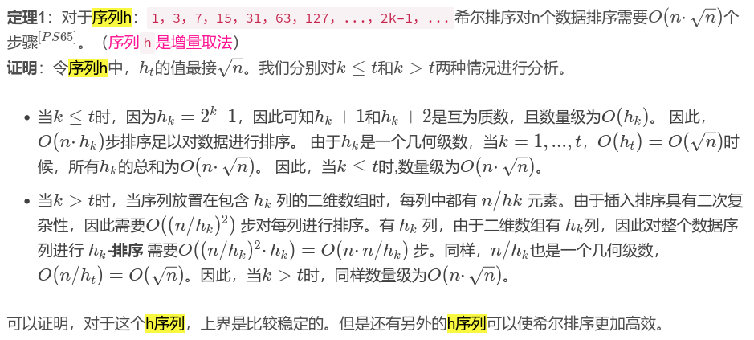
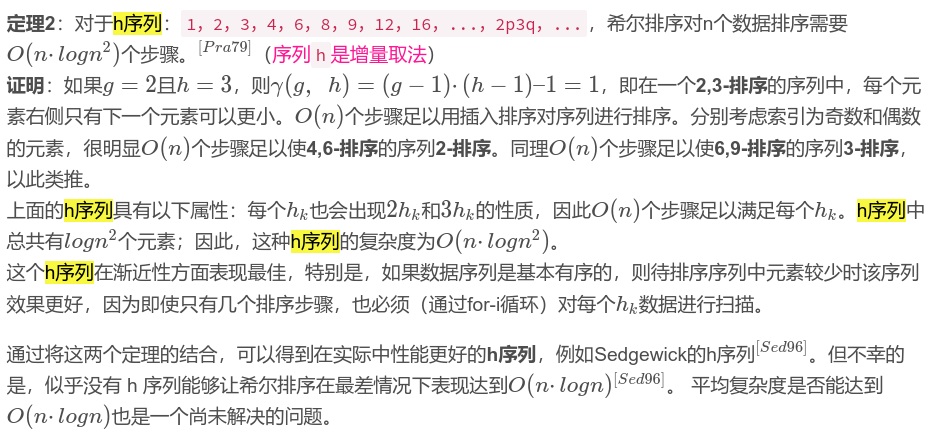

# 数据结构第一次实验报告

姓名：丁屹	学号：2013280

## 实验题目

已知一个长度为n的数组，数值范围为10-99，对该数列进行排序，将个位数的大小作为第一排序标准，将十位数的大小作为个位数相同的子集的排序标准对数列进行排序。

## 实验要求

1. 给出算法设计思想并用C++实现
2. 用两种方法实现
   - 借助辅助空间实现对数列的排序
   - 不借助辅助空间实现对数列的排序
3. 分别分析所设计的两种算法的时间复杂度和空间复杂度
## 实验样例

- 输入

  ```shell
  31 59 44 21 78 58 18 89 33
  ```

- 输出

  ```shell
  21 31 33 44 18 58 78 59 89
  ```

## 实验内容、步骤

- 目录结构如下：

  ./demo1
  ├── main.cc
  ├── sort1.hh
  └── sort2.hh

- 借助辅助空间实现对数列的排序由sort1.hh实现，不借助辅助空间实现对数列的排序由sort2.hh实现，main.cc处理输入，并分两行输出

- 其中sort1.hh实现了基数排序，sort2.hh实现了希尔排序
  
- sort1.hh核心代码

  ```c++
  template<typename Iterator>
  inline void sort1(Iterator first, Iterator last, unsigned radix = 10) {
    using namespace std;
    using Ele_t = decltype((*first)++);
    vector<deque<Ele_t>> buf(radix + 1);
    vector<Ele_t> powRadix;
    auto maxEle = *first;
    for (auto it = first; it != last; ++it)
      maxEle = max(maxEle, *it);
      __uint128_t t = 1;
    do {
      powRadix.push_back(t);
    } while ((t *= radix) / radix <= maxEle);
    for (auto i = powRadix.size() - 1; i; --i) {
      for (auto it = first; it != last; ++it)
        buf[((*it) % powRadix[i]) / powRadix[i - 1]].push_back(*it); //hash
      auto it = first;
      for (auto k = 0; k < radix && it != last; ++k) { //write back
        while (!buf[k].empty()) {
          (*it++) = buf[k].front();
          buf[k].pop_front();
        }
      }
    }
  }
  ```

- sort2.hh核心代码

  ```c++
  template<typename Iterator>
  inline void sort2(Iterator first, Iterator last, unsigned radix = 10) {
    using namespace std;
    using Ele_t = decltype((*first)++);
    function<bool (Ele_t, Ele_t)> comp = [radix](Ele_t x, Ele_t y) -> bool {
      while (x || y) {
        auto xx = x % radix, yy = y % radix;
        if (xx != yy) return xx < yy;
        x /= radix, y /= radix;
      }
      return false;
    };
    int len = last - first, step;
    while (step < len / 3)
      step = 3 * step + 1;
    while (step >= 1) {
      for (auto i = step; i < len; i++)
        for (auto j = i; j >= step && comp(*(first + j), *(first + (j - step))); j -= step)
          swap(*(first + j), *(first + (j - step)));
      step = step / 3;
    }
  }
  ```

- 输出

  ```shell
  21 31 33 44 18 58 78 59 89
  21 31 33 44 18 58 78 59 89
  ```

- 时间复杂度分析

  - sort1.hh即基数排序：
    - 预处理powRadix数组为O(logm)，m为数字最大值
    - 嵌套循环：外层为O(logm)，内层为O(n)，故为O(nlogm)
    - 故总时间复杂度为O(nlogm)，题中m<100，log(m)很小，可当作常数
    
  - sort2.hh即希尔排序：

    - 希尔排序的时间复杂度由步长决定

    - 希尔排序是插入排序的改进版

    - 希尔排序在步长不同的子序列上进行插入排序

    - 本程序使用1969年由Knuth提出的序列1 4 13 40 121 364 1093 3280 9841，增量之间的比率约为三分之一

    - Knuth 发现应排序效率接近 O(n(logn)^2^ )和O(n^1.25^) 

    - 一些证明：

    

    

## 实验总结

- 实现了逆向选取关键字的基数排序和希尔排序
- 分析了基数排序的时间复杂度为O(nlogm)
- 查阅资料并学习了希尔排序时间复杂度的分析，本次选取的步长时间复杂度大约在O(n(logn)^2^ )和O(n^1.25^) 之间
